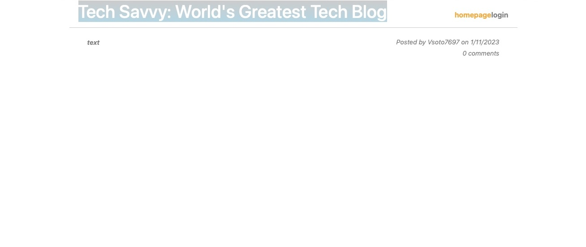

# Tech-Blog

## Table of Contents

- [Description](#description)
- [Technology](#Technology)
- [Usage](#usage)
- [License](#license)
- [Questions](#questions)

## Description:

This project builds a blog-like website using the Model-View-Controller (MVC) framework. Developers can create an account, edit their information, make posts, edit posts, and comment on posts made by other users.

## Technology:

Project is created with:

- Javascript
- Node.js
- Express.js
- dotenv
- MySQL
- Sequelize
- Bcrypt
- handlebars
- Heroku
- JawsDB

## Usage
The application is deployed on Heroku at https://tech-savvyblog.herokuapp.com

#### Screenshot

## License  
This project is covered under the No License license.

## Questions
Have questions about this project?  
GitHub: https://github.com/Vsoto7697  
Email: Vsoto7697@gmail.com
